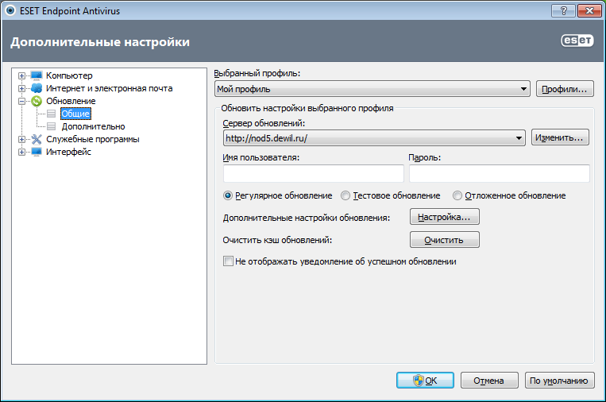

# Nod32 инструкция по установке

- Скачайте программу под вашу платформу (version 5).
	- Версии
		- Win 32 bit https://www.dropbox.com/s/j6pbmptydatke9u/eea_nt32_rus.5.0.2237.1.msi?dl=1
		- Win 64 bit https://www.dropbox.com/s/0dkki0xu3s236i3/eea_nt64_rus.5.0.2237.1.msi?dl=1
- Установить программу на компьютер.
	- При установке выбирается все по умолчанию.
	- Когда спросит логин/пароль, выбрать `Установить параметры обновления позже`.
- После установки открыть окно программы. (кликнуть мышкой по значку возле часов)
- Нажать F5 для открытия окна `Настроек`.
- Выбрать меню `Обновление`.
- В список серверов добавить `http://nod5.dewil.ru/` (не https)
- Если вам выдали логин и пароль, то ввести их в соответсвующие поля. Если у вас фиксированный IP адрес, то авторизация будет приниматься с него без пароля.
- Можно пользоваться Антивирусом (никому не давать пароль). На сервере ведется статистика по использованию обновлений. В случае утечки логина, он будет заблокирован автоматически.
- Пример настроек
	- 
	- Не забудьте указать логин и пароль.

Очень полезная утилина [Online Scaner](https://www.esetnod32.ru/support/scanner/) для разовой проверки ОС без установки Антивируса.

Будьте осторожны!